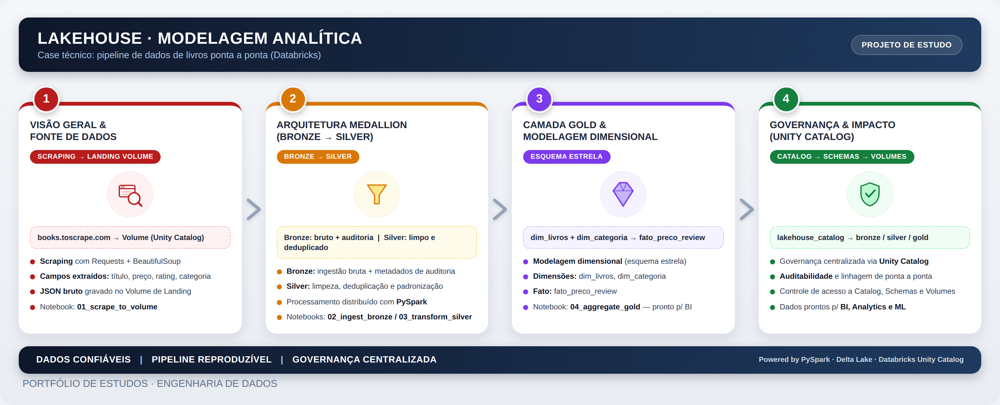

# Arquitetura — Modelagem Analítica para Ambiente Lakehouse

## Visão Geral

Este projeto implementa um pipeline completo de dados sobre um Lakehouse, adotando a **arquitetura medalhão (Medallion Architecture)** — **Bronze**, **Silver** e **Gold** — com governança via **Databricks Unity Catalog**.

Como estudo de caso (portfólio), o pipeline extrai dados reais via **web scraping** do site público [books.toscrape.com](https://books.toscrape.com/) (um site de demonstração, aberto e mantido especificamente para prática de scraping), armazena os dados brutos em um **Volume** e os transforma progressivamente até um modelo dimensional pronto para consumo analítico.

```
 Scraping             Volume            Bronze             Silver              Gold
 (books.toscrape)   (landing_volume)  (livros_raw)      (livros limpos)   (modelo estrela)

  [Site] ───────▶ [Volume JSON] ───▶ [bronze.*] ─────▶ [silver.*] ─────▶ [gold.*] ───▶ BI
```

## Diagrama da Arquitetura



## 1. Extração de Dados (Scraping → Volume)

- Os dados são coletados do site `books.toscrape.com` com **Requests** e **BeautifulSoup**, extraindo título, preço, avaliação (rating), disponibilidade e categoria de cada livro.
- O resultado é gravado como um arquivo **JSON bruto** no Volume do Unity Catalog (`lakehouse_catalog.bronze.landing_volume`), preservando os dados exatamente como coletados.
- Implementado em: funções em `src/common/scraping_utils.py` + notebook `notebooks/01_scrape_to_volume.ipynb`.

## 2. Camada Bronze

- Lê o(s) arquivo(s) JSON do Volume e grava, sem transformação, na tabela `lakehouse_catalog.bronze.livros_raw`, adicionando metadados de auditoria (arquivo de origem e timestamp de ingestão).
- Mantém histórico completo (append-only) para rastreabilidade.
- Implementado em: funções em `src/common/bronze_utils.py` + notebook `notebooks/02_ingest_bronze.ipynb`.

## 3. Camada Silver

- Aplica limpeza e tipagem: conversão de preço textual (`£51.77`) para `DECIMAL(10,2)`, rating textual (`Three`) para `INT`, disponibilidade textual para `BOOLEAN`.
- Gera um identificador estável (`id_livro`) via hash de título + categoria, e remove duplicados mantendo o registro mais recente.
- Grava o resultado em `lakehouse_catalog.silver.livros`.
- Implementado em: funções em `src/common/silver_utils.py` + notebook `notebooks/03_transform_silver.ipynb`.

## 4. Camada Gold — Modelagem Dimensional

A camada Gold segue os princípios de modelagem dimensional (esquema estrela):

- **dim_livro**: título e categoria de cada livro.
- **dim_categoria**: categorias distintas.
- **dim_tempo**: datas de coleta, com ano, mês, trimestre e nome do mês.
- **fato_preco_livro**: fato com preço, rating e disponibilidade por livro/categoria/data de coleta.

Isso permite consultas analíticas como preço médio e rating médio por categoria, evolução de preços ao longo do tempo, e disponibilidade de estoque.

- Implementado em: funções em `src/common/gold_utils.py` + notebook `notebooks/04_aggregate_gold.ipynb`.

## Implementação no Databricks (Unity Catalog)

A hierarquia de objetos de governança segue o padrão Unity Catalog:

```
Catalog (lakehouse_catalog)
 ├── Volume
 │    └── bronze.landing_volume  →  /Volumes/lakehouse_catalog/bronze/landing_volume/livros/
 │
 ├── Schema bronze  →  livros_raw
 ├── Schema silver  →  livros
 └── Schema gold    →  dim_livro, dim_categoria, dim_tempo, fato_preco_livro
```

Configuração completa em `sql/ddl/00_setup_unity_catalog.sql`:

- **Catalog**: `lakehouse_catalog` isola os dados do projeto no workspace.
- **Schemas**: um por camada (`bronze`, `silver`, `gold`), permitindo permissões e organização independentes.
- **Volume**: `lakehouse_catalog.bronze.landing_volume` armazena os arquivos brutos coletados via scraping, antes da ingestão.
- **Tabelas**: sempre referenciadas pelo nome completo `catalog.schema.tabela` (ex.: `lakehouse_catalog.gold.fato_preco_livro`).

## Organização do código: funções (.py) vs. transformações (.ipynb)

Para manter o projeto organizado e reutilizável, o código segue uma separação clara:

- **`src/common/*.py`** — contém **apenas funções** reutilizáveis (sessão Spark, scraping, limpeza, construção de dimensões/fato). Nenhuma lógica de execução direta acontece aqui.
- **`notebooks/*.ipynb`** — notebooks Databricks que **importam as funções** dos módulos `.py` e orquestram a execução real do pipeline (extração, ingestão, transformação e agregação), como seria feito em um workspace Databricks.

## Ferramentas

- **Apache Spark / PySpark**: motor de processamento distribuído.
- **Requests / BeautifulSoup**: extração (scraping) dos dados de origem.
- **SQL**: definição de esquemas (DDL) e consultas analíticas.
- **Delta Lake** (conceitual): confiabilidade transacional (ACID), versionamento e time travel.
- **Databricks Unity Catalog**: governança centralizada de Catalogs, Schemas, Volumes e Tabelas.
- **Jupyter/Databricks Notebooks (.ipynb)**: orquestração e execução das transformações.

## Fluxo de Execução

1. **Setup (Unity Catalog)**: `sql/ddl/00_setup_unity_catalog.sql` cria o Catalog, os Schemas e o Volume.
2. **Criação das tabelas**: `sql/ddl/01`, `02` e `03` criam as tabelas de cada camada.
3. **Scraping → Volume**: `notebooks/01_scrape_to_volume.ipynb` coleta os dados e grava no Volume.
4. **Ingestão Bronze**: `notebooks/02_ingest_bronze.ipynb`.
5. **Transformação Silver**: `notebooks/03_transform_silver.ipynb`.
6. **Agregação Gold**: `notebooks/04_aggregate_gold.ipynb`, incluindo uma consulta analítica de exemplo.

## Status

✅ Pipeline completo, do scraping à camada Gold, com governança via Unity Catalog.

## Próximos Passos

- Agendar a execução dos notebooks via Databricks Workflows (Jobs).
- Incluir testes automatizados de qualidade de dados.
- Explorar otimizações de performance (particionamento, Z-Ordering, cache).
